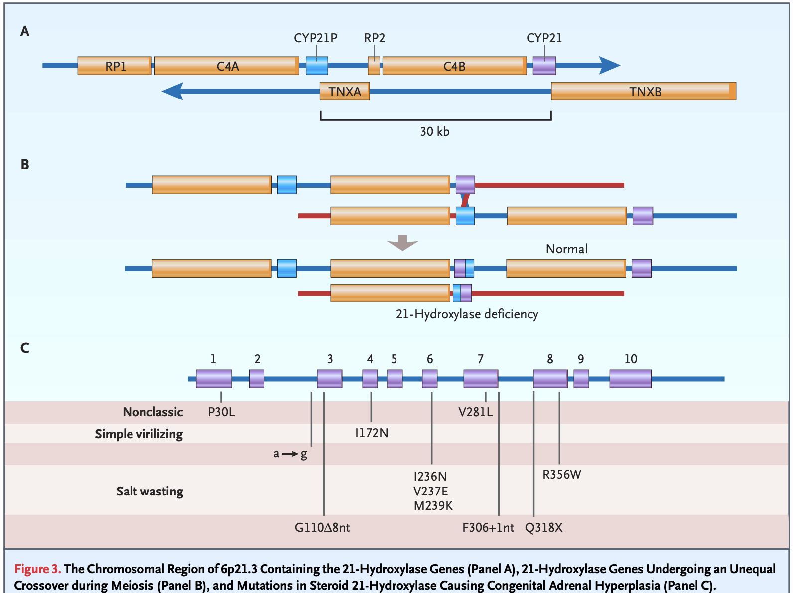

# Congenital Adrenal Hyperplasia

## Description

* * Group of inherited genetic disorders leading to impaired steroidogenesis
    * Presence of adrenal glands 
    * Absence of adequate cortisol synthesis
* adrenal insufficiency by dysfunction of 
    * **adrenal gland** (primary) 
    * **pituitary gland** (secondary)

* 21-hydroxylase deficiency (Classic form) 
    * Most common (>90%) [[📖]](https://doi.org/10.1210/jc.2018-01865 "Speiser, 2018")
    * autosomal-recessive disorder
    * chromosome 6p21.3
    * mutation in CYP21A2

## Classification 
* Classic form 
    * severe form: 0-5% enzyme activity
* deficiency of cortisol, aldosterone and adrenaline and overproduction of adrenal androgens [[📖]](https://doi.org/10.1210/endrev/bnab016 "Claahsen-van der Grinten, 2021")
    * Low intra-adrenal levels of cortisol -> adrenomedullary dysplasia -> deficiency in adrenalin [[📖]](https://doi.org/10.1056/nejm200011093431903 "Merke, 2000")
    * salt wasters (75%):  
        * 0% enzyme activity
        * deficiency in cortisol and aldosterone synthesis [[📖]](https://doi.org/10.1210/edrv.21.3.0398 "White, 2000")
    * simple virilisers: 
        * <5% enzyme activity
        * elevated concentrations of androgens [[📖]](https://doi.org/10.1210/jc.2018-01865 "Speiser, 2018")
        * some ability to produce aldosterone 
    * Prevalence
        * 1:15,000-16,000 in Europe and the USA [[📖]](https://doi.org/10.1530/eje.0.151u071 "van der Kamp, 2004")
        * 1:19,000 in Japan [[📖]](https://doi.org/10.1530/eje.0.151u071 "van der Kamp, 2004")
        * 1:14,000-18,000 worldwide [[📖]](https://doi.org/10.1210/endrev/bnab016 "Claahsen-van der Grinten, 2021")
* Non-classic form: 
    * 20-50% enzyme activity
    * slightly elevated androgen concentrations
    * Prevalence
        * 1:200 in the USA [[📖]](https://doi.org/10.1038/gim.2017.46 "Hannah-Shmoun, 2017")
        * 4.0–7.5% Carrier frequency in Europe [[📖]](https://doi.org/10.1157/13080213 "Ezquieta, 2005") [[📖]](https://doi.org/10.1111/cge.12153 "Phedonos, 2013") [[📖]](https://doi.org/10.1210/jc.2004-1728 "Baumgartner-Parzer, 2004")

## Genetic background 

*Figure from [[📖]](https://doi.org/10.1210/jc.2018-01865 "Speiser, 2018").*

## Available treatment approaches
*  management of CAH should account for biological effects and interrelationship between glucocorticoid, mineralocorticoid and adrenal steroids
### Glucocorticoid therapy
* re-set hormonal imbalance by replacing deficient hormones
* fail to replicate the <u>physiological cortisol circadian rhythm</u>
* usually supraphysiological doses to achieve sufficient reduction in androgen biosynthesis
* formulations
    * short-acting: Hydrocortisone
        * 6–8 h 
        * preferred in children with CAH: short half-life and the lowest growth suppressing effect [[📖]](https://doi.org/10.1210/jc.2018-01865 "Speiser, 2018") [[📖]](https://doi.org/10.1210/jc.2006-2109 "Bonfig, 2007")
    * intermediate-acting: Prednisone, Prednisolone, Methylprednisolone
        * 12–36 h 
    * long-acting: Dexamethasone
        * 36–54 h 
* 1/3 of adults receive hydrocortisone and 2/3 long-acting glucocorticoids
    * UK cross-sectional CAH adult study (CaHASE) from 17 centres (n = 203) [[📖]](https://doi.org/10.1210/jc.2010-0917 "Artl, 2010")
    * cross-sectional study from our USA centre (n = 244) [[📖]](https://doi.org/10.1210/jc.2012-2102 "Finkielstain, 2012")

### Mineralocorticoid therapy
* to correct aldosterone deficiency
* small enzyme activity and aldosterone production is not sufficient to maintain normal intravascular volume [[📖]](https://doi.org/10.1515/jpem.2001.14.9.1649 "Frisch, 2001") [[📖]](https://doi.org/10.1210/jc.2006-0964 "Nimkarn, 2006")
* therapy received during childhood ~> <u>a taller height</u> outcome compared when not received [[📖]](https://doi.org/10.1210/jc.2009-2616 "Muthusamy, 2010")

* formulation
    * 9α-fludrocortisone
        * 18–36 h
        * risk factor of hypertension in children aged <8 years [[📖]](https://doi.org/10.1093/ajh/hpv087 "Bonfig, 2015") [[📖]](https://doi.org/10.1210/clinem/dgab133 "Torky, 2021")
        * adolescents have reduced (18.5% -> 4.9%) risk of hypertension 
    * All glucocorticoids (except dexamethasone) have mineralocorticoid activity
        * potency of 0.1 mg of fludrocortisone is achieved by ~40 mg of hydrocortisone [[📖]](https://doi.org/10.7326/0003-4819-43-5-979 "Thorn, 1955")
        * potency of 1.0 mg of hydrocortisone is achieved by 0.1 mg of fludrocortisone [[📖]](https://doi.org/10.1186/1710-1492-9-30 "Liu, 2013")

List of works used for litor literature review:
- [[📖]](https://doi.org/10.1038/ "Mallappa, 2022")

---

