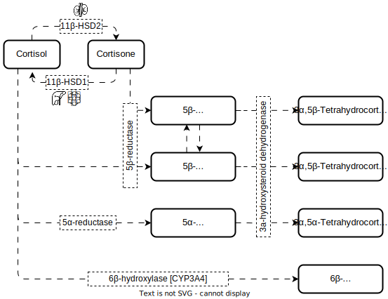

# Hydrocortisone 
## Introduction
* synthetic cortisol
    * cannot be bioanalytically separated from endogenous cortisol [[📖]](https://doi.org/10.1007/s40262-017-0575-8 "Melin, 2018")
* the relatively short half-life of 1.5 h
* lack of licensed formulation for this population (for <6yo)
* Dose
    + still growing children: 8 mg/m$^2$/day divided in 3-4 doses [[📖]](https://doi.org/10.1210/jc.2015-1710 "Bornstein, 2016")
    + more specific:  10-15 mg/m$^2$/day divided into 3 doses [[📖]](https://doi.org/10.1210/jc.2009-2631 "Speiser, 2010")
    + recommended daily dose to adult patients with adrenal insufficiency [[📖]](https://doi.org/10.1210/jc.2015-1710 "Bornstein, 2016")
        + at 06:00 10 mg
        + at 14:00 5 mg
        + at 22:00 5 mg 
* modified release formulations [[📖]](https://doi.org/10.1136/archdischild-2015-309538 "Porter, 2016")
    + Plenadren 
    + Chronocort
* administration 
    + subcutaneously via insulin -> circadian cortisol profile and improved 17-OHP concentrations [[📖]](https://doi.org/10.1111/cen.12453 "Hindmarsh, 2014")
* BCS (biopharmaceutical classification system) **class II** [[📖]](https://doi.org/10.1023/a:1016212804288 "Amidon, 1995")
    + low dissolution rate and high intestinal permeability [[📖]](https://doi.org/10.1517/17425255.4.6.749 "Lennernäs, 2008")

---

## Pharmacokinetics
### Absorption
* Parameters
    + passive diffusion and is a poor substrate for the efflux protein P-glycoprotein [[📖]](https://doi.org/10.1517/17425255.4.6.749 "Lennernäs, 2008")
    + $T_{max}$
        - tablet 1-1.7 h 
            - note: 1.7 h in high dose 50 mg [[TBA]]()
        - solution 0.7-1 h
        - pediatric adrenal insufficiency 0.33-3 h
    + $t_{1/2,abs}$ [[📖]](https://doi.org/10.1111/j.1365-2265.2004.02106.x "Mah, 2004")
        - fasting: 15 min
        - fed: 43 min 
    + $C_{max}$
        - 75th percentile of observed data [[📖]](https://doi.org/10.1210/jcem.82.2.3769 "Knutsson, 1997")
    + F 
        - 100% when dose of <20 mg
        - 54% when dose of 50 mg in patients with adrenal insufficiency [[📖]](https://doi.org/10.1111/j.1365-2125.1984.tb04999.x "Heazelwood, 1984")
### Distribution
* Parameters
    + $V_{c}$
        - 7 to 23.9 L iv
        - 28.4 L when dose of 50 mg in patients with adrenal insufficiency [[📖]](https://doi.org/10.1111/j.1365-2125.1984.tb04999.x "Heazelwood, 1984")
    + $V_{c}/F$ or relative volume of distribution
        - 38.7-52.3 L patients with adrenal insufficiency
        - 17.5 ± 10.5 L pediatric patients [[📖]](https://doi.org/10.1097/jim.0000000000000121 "Sarafoglou, 2015")
        - 27.1 ± 8.4 L prepubertal 
        - 49.5 ± 12.2 L pubertal
        - 40.8 ± 16.0 L prepubertal
            - [[📖]](https://doi.org/10.1210/jcem.86.6.7522 "Charmandari, 2001a")
    + $V_{ss}$
        - increasing with increasing doses [[📖]](https://doi.org/10.1007/bf01062332 "Toothaker, 1981")
        - 5 mg: 20.7 ± 7.3 L
        - 40 mg: 37.5 ± 5.8 L
### Metabolism
* [[📖]](https://doi.org/10.1111/j.1365-2265.2005.02412.x "Hoshiro, 2006")
    + 11β-hydroxysteroid dehydrogenase
        - bidirectional 
        - type 1 (11β-HSD1) to cortisol liver and adipose
            - undetectable $<3$ months
            - stabilized approx. at 12 months
        - type 2 (11-βHSD2) to cortisone in kidney
            - increased from 0-52 weeks,
    + 5α-reductase(cortisol) and 5β-reductase (cortisone)
        - unidirectional
            - low in newborns 
            - highest activity >3 months
            - declined <52 weeks 
            - similar 3.5-17.5 years 
    + 3α-hydroxysteroid
        - unidirectional
    + 6β-hydroxylase (CYP3A4)
        - unidirectional
        - approx. 1%

*Metabolic pathway of cortisol. Figures were adapted from [PhD thesis of Johanna Melin](https://refubium.fu-berlin.de/handle/fub188/23620). Created using [diagrams.net](https://app.diagrams.net/)*

### Elimination      
* At least 90% of cortisol and cortisone metabolites are normally excreted as sulfate or glucuronide conjugates. Conjugation of cortisol and cortisone can occur at the 21 position, and 3α-reduced steroids can also be conjugated at the 3α position
* Parameters
    + $CL$
        - dose-dependent CL
        - lower in neonates (due to maturation of metabolic enzymes)
        - 12.5 to 20.2 L/h (iv 5-50 mg)
        - 12.5 L/h (iv 5 mg)
        - 17.6 L/h (iv 40 mg)
        - note: Saturation of CBG leads to $CL_u$ increasing disproportionally with respect to $CL_{tot}$.
        - CL ($CL_u$)  remains constant, since it is independent of $f_u$.
    + $CL/F$
        - 19.1 L/h (oral 10-20 mg: F≈1)
        - 27.3 L/h (50 mg)
        - 12.4-25.6 L/h (patients with adrenal insufficiency)
        - note: highest value in pubertal patients
    + $AUC$
        - nonlinear processes (e.g. saturable plasma protein binding or saturable absorption)

---

## Pharmacodynamics
* Effect
    + endogenous cortisol synthesis
    + T cell dynamics [[📖]](https://doi.org/10.1177/0091270003258651 "Mager, 2003")
* correlation with **17-OHP** concentration 
    + 1 h post dose
    + delayed inhibitory effect with r=-0.302 [[📖]](https://doi.org/10.1210/jcem.86.6.7522 "Charmandari, 2001a")
* no correlation between AUC for cortisol and 17-OHP [[📖]](https://doi.org/10.1097/jim.0000000000000121 "Sarafoglou, 2015")

---

## Formulations and Administration 
* Lowest available dose for a oral tablet
    * 5  mg in USA
    * 10 mg in Europe or Canada
### Infacort ®
* <u>Diurnal Ltd</u>
* immediate-release hydrocortisone
* Brand name: Alkindi (with four doses: 0.5 mg, 1 mg, 2 mg and 5 mg)
* Approval for children with adrenal insufficiency from regulatory agencies [[📖]](https://doi.org/10.1111/cen.13447 "Neumann, 2018")
    * EMA - 2018
    * FDA - 2020
* oral (po)
* hydrocortisone granules with taste masking
    * dry granules or mixed with a small amount of soft food
* analysis in adults with a NCA by [[📖]](https://doi.org/10.1210/jc.2014-4060 "Whitaker, 2015")
    * does not account for known nonlinearities of cortisol
* good disease control with normal growth and no increased risk of adrenal crises [[📖]](https://doi.org/10.1210/clinem/dgaa626 "Neumann, 2021")

### Licensed Hydrocortisone tablet
* <u>Auden Mackenzie Ltd</u>
* oral (po)

### Hydrocortisone Succinate
* intravenous (iv) bolus 
* HC administration

### Hydrocortisone cypionate suspension
* Pharmacia & UpJohn
* voluntarily recalled in July 2000 [[📖]](https://doi.org/10.1210/jcem.86.1.7275 "Merke, 2001")
* possible inaccuracies in preparations can lead to unanticipated adverse effects [[📖]](https://doi.org/10.1210/jc.2017-01595 "Barillas, 2018")

---

