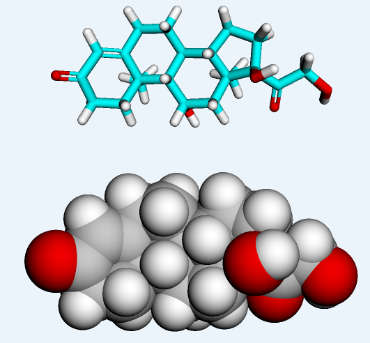
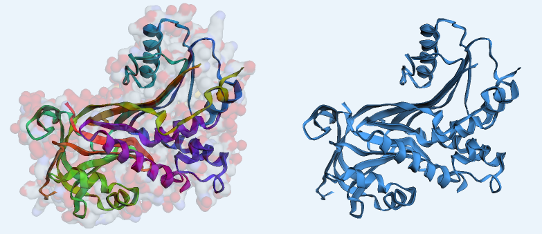

# System Components
## Cortisol
* cannot be bioanalytically separated from endogenous cortisol [[📖]](https://doi.org/10.1007/s40262-017-0575-8 "Melin, 2018")
* major glucocorticoid
*  Chemical properties
    * $C_{21}H_{30}O_5$
    * Average mass: 362.460 Da or g/mol [[📖]](https://www.chemspider.com/Chemical-Structure.5551.html "ChemsSpider")
    * IUPAC name: 11β,17α,21-Trihydroxypregn-4-ene-3,20-dione
    * Molecule Type: Small molecule

*Chemical Structure of Cortisol. Figure from [ChEMBL](https://www.ebi.ac.uk/chembl/compound_report_card/CHEMBL389621/).*

*Chemical structure of Cortisol. Created using py3Dmol tool.*

*Interactive chemical structure of Cortisol. Created using 3Dmol.js tool.*

* a negative feedback on CRH and ACTH release, thereby inhibiting the HPA axis [[📖]](https://doi.org/10.1016/s0022-3999(02)00429-4 "2002_Tsigos")
* saturable plasma protein binding of cortisol occurring at high cortisol concentrations [[📖]](https://doi.org/10.1007/bf01062332 "1981_Toothaker")
* maturation factors
    + amount of body water
      - 80-85% in young infants
      - 55-60% in adults
    + fat content
      - 10-15% at birth
    + maturation of plasma proteins
    + ↓$[CBG]$ in neonates = ↑ $CL_u$ [[📖]](https://doi.org/10.1203/00006450-197501000-00008 "1975_Hadjian")

---

## <kbd>**CBG**</kbd>
* **Corticosteroid-Binding Globulin**
* low conc. relative to albumin
    + albumin: 35,000-50,000 mg/L [[📖]](https://books.google.com.sg/books?hl=en&lr=&id=i1DC3KlTAB8C&oi=fnd&pg=PP2&dq=T.+Peters+Jr.+All+about+Albumin:+Biochemistry,+Genetics,+and+Medical+Applications.+Academic+Press,+Oxford,+UK+(1996).&ots=WZBgiT1oad&sig=t6YtiXhHhbZKB0gaotMGeXZDHmo#v=onepage&q&f=false "1992_Peters")
    + CBG: 14.9-67.1 mg/L [[📖]](https://doi.org/10.1016/s0009-8981(02)00417-5 "2003_Lewis")
      - elevated: 
        - pregnant women (2-3 fold) [[📖]](https://doi.org/10.1016/j.neuroscience.2011.02.053 "2011_Henley")
        - synthetic oral oestrogens [[📖]](https://doi.org/10.1210/jcem-27-10-1463 "1967_Musa")
        - Mitotane, an adrenolytic agent for adrenocortical carcinoma [[📖]](https://doi.org/10.1530/acta.0.1240526 "1991_Vanseters")
        - some patients with chronic active hepatitis
      - reduced: 
        - neonates (note: infants reach adult values) [[📖]](https://doi.org/10.1203/00006450-197501000-00008 "1975_Hadjian")
        - patients with Cushing's syndrome (33.2 ± 5.6 mg/L) [[📖]](https://doi.org/10.1016/0022-4731(87)90071-9 "1986_Coolens")

* Saturation of CBG
    + at total cortisol concentrations ($C_{tot}$) above 200 ng/mL or 550 nmol/L [[📖]](https://doi.org/10.1007/bf01062332 "1981_Toothaker")
    + unbound cortisol concentration ($C_{u}$) increases disproportionally with respect to $C_{tot}$
* lower in neonates, whereas infants had reached adult values
* 3D structure [[📖]](https://doi.org/10.1074/jbc.m705014200 "2007_Klieber")

*Chemical structure of CBG. Created using py3Dmol tool.*

*Interactive chemical structure of CBG. Created using 3Dmol.js tool.*

---

## <kbd>**17-OHP**</kbd>
* **17-hydroxyprogesterone** or **17-OH-Progesterone**
* used as biomarker of CAH
* seems to have a circadian variation (>12 months) [[📖]](https://doi.org/10.1373/49.10.1688 "2003_Groschl")
* conc. range of 12-36 nmol/L -> target for therapy [[📖]](https://doi.org/10.1016/s0140-6736(05)66736-0 "2005_Merke")
    + note: when measured in the early morning before medication

*Chemical structure of 17-OHP. Created using py3Dmol tool.*

*Interactive chemical structure of 17-OHP. Created using 3Dmol.js tool.*

---

## <kbd>**ACTH**</kbd>
* **AdrenoCorticoTrophic Hormone**
* [[link]](https://pubchem.ncbi.nlm.nih.gov/compound/Corticotropin)
* Increased production in CAH 
    * due to 
      * feedback loop from decreased cortisol production
      * aldosterone insufficiency -> volume depletion -> vasopressin synthesis [[📖]](https://doi.org/10.1530/eje.0.1430099 "2000_Arvat")
    * leads to [[📖]](https://doi.org/10.1056/nejmra1909786 "2020_Merke")
      * adrenocortical hyperplasia as well as the 
      * synthesis of adrenal androgens and androgen precursors, 
      * synthesis of 17-OHP and androstenedione
---

## <kbd>**HPA-axis**</kbd>
* **Hypothalamic-Pituitary-Axis**
* follow a **circadian rhythm**
* Cortisol is inhibits the HPA axis
    * major glucocorticoid and 
    * negative feedback on CRH and ACTH release
* Classic CAH
    * absence of negative feedback
    * increased production of corticotropin-releasing factor (CRF) in hypothalamus
    * increased production of adrenocorticotrophic hormone (ACTH) in pituitary gland
    * main reason for overproduction of androgens

---

## Steroid synthesis
* Steroid synthesis of mineralocorticoids, glucocorticoids and androgens
* healthy and CAH

*Steroid synthesis pathway. Figures were adopted from [PhD thesis of Johanna Melin](https://refubium.fu-berlin.de/handle/fub188/23620).*

---

     
  

