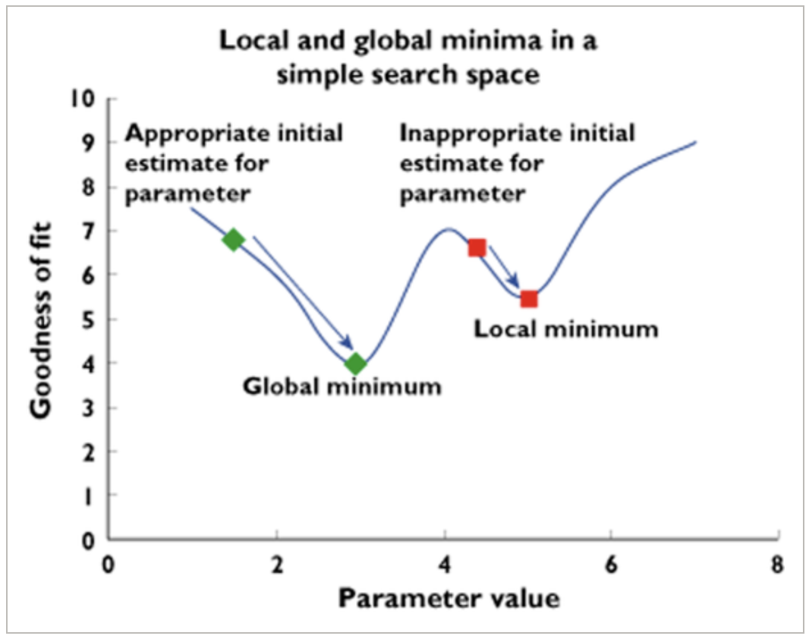

# Parameter Estimation
* parameter values define “goodness” of the model

## Objective Function Value
* represents the goodness of fit [[📖]](https://doi.org/10.1038/psp.2013.14 "2013_Mould")
* proportional to minus 2 times the log likelihood (-2LL)
* extended least squares **ELS** objective function [[📖]](https://doi.org/10.1007/bf01060053 "1980_Sheiner")
* the preference is given to lower OFV [[📖]](https://doi.org/10.1038/psp.2013.14 "2013_Mould")
    * by iterative “hill climbing” procedure to find the lowest OFV, or minima, within a given search space. [[📖]](https://books.google.de/books?hl=en&lr=&id=JEcwQgngoE8C&oi=fnd&pg=PA1&dq=Cambini,+A.,+%26+Martein,+L.+(2008).+Generalized+convexity+and+optimization:+Theory+and+applications+(Vol.+616).+Springer+Science+%26+Business+Media.&ots=bah69g9QPg&sig=Kwa2904XtX65SkbLCrqmrqa23W4&redir_esc=y#v=onepage&q&f=false "2008_Cambini")
* Initial parameter estimates have an important role [[📖]](https://doi.org/10.1111/bcp.12179 "2015_Sale")
    * estimation can be “trapped” gradient search in local OFV minima, and “mask” the global minimum 

 *Figure was adopted from [[📖]](https://doi.org/10.1111/bcp.12179 "2015_Sale").*

---

## Algorithms
### Gradient-based algorithms
* Taylor series approximations for numerical solution of the likelihood function
* 

### <kbd>**FOCE**</kbd>
* **First-Order Conditional Estimation algorithm**
* linearised by conditioning on the individual etas [[📖]](https://doi.org/10.1038%2Fpsp.2014.51 "2014_Owen") [[📖]](https://doi.org/10.1007/s10928-014-9359-z "2014_Johansson")

### <kbd>**FOCEI**</kbd>
* **First-Order Conditional Estimation algorithm with interaction**
* considering the interaction between ε and η [[📖]](https://doi.org/10.1038%2Fpsp.2014.51 "2014_Owen")

### <kbd>**LAPLACE**</kbd>
* [[📖]](https://doi.org/10.1007/s10928-014-9359-z "2014_Johansson")
* second-order approximation
* only gradient-based estimation method 
* can be used for categorical data
* can be used to consider observations below LLOQ
* more unstable than e.g. FOCE

### <kbd>**SAEM**</kbd>
* **Stochastic Approximation Expectation Maximisation**
* [[📖]](https://doi.org/10.1208/aapsj0901007 "2007_Bauer")
* step E: stochastic approximation
* step M: maximises the expected likelihood
* includes one burn-in and one accumulation phase [[📖]](https://www.semanticscholar.org/paper/NONMEM-User%E2%80%99s-Guides.-(1989%E2%80%932009)-Beal-Boeckmann/1964357daa9975ac959840262a810b2e0b39c8f4 "2009_Beal")
    * burn-in: approximation is done on few samples per individual, and maximised and the process is repeated until the estimates have stabilised
    * accumulation: the individual random-effects are sampled and averaged together
### <kbd>**IMP**</kbd>
* **IMPortance sampling**
* [[📖]](https://doi.org/10.1208/aapsj0901007 "2007_Bauer")
    * step E: Monte-Carlo integration to assess the conditional mean and variance of $η_i$
    * step M: maximises the expected likelihood
* objective function is commonly generated by few iterations of IMP for the final parameter estimates.

> Note: [[📖]](https://doi.org/10.1007/s10928-014-9359-z "2014_Johansson")  
> **step E** *expectation* evaluates the expected likelihood with respect to the conditional distribution of $η_i$ based on the current parameter estimates and the observed data;  
> **step M** *maximisation* maximises the expected likelihood (from step E) to generate new parameter estimates.

