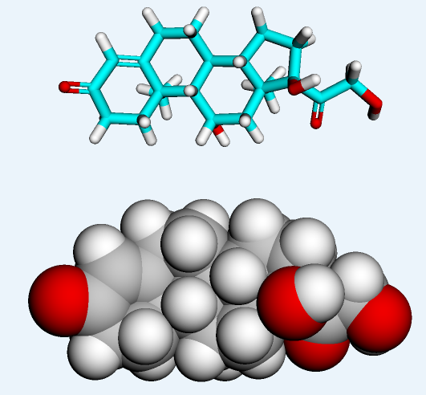

# Python code

## py3Dmol
### Description
* To visualize molecular structures in 3D.
* Interactive: Real-time manipulation (rotate, zoom).
* Customizable: Various styles (stick, sphere, cartoon) and colors.
* Ease of Use: Simple API for Python users.
* Ideal for Jupyter Notebooks.
* Open Source [[py3dmol GitHubwebpage]](https://github.com/avirshup/py3dmol)

### Example 1 (cortisol) input
```python
#cortisol
import py3Dmol

view = py3Dmol.view(query='cid:5754')

view.setStyle({'stick': {'color':'spectrum'}})
view.zoomTo()
view.render()
```

### Example 1 (cortisol) output


### Example 2 (CBG) input
```python
# CBG
import py3Dmol

view = py3Dmol.view(width=800, height=800, query='pdb:2V95', viewergrid=(2,2), linked=True)

view.setStyle({'cartoon': {'color': 'spectrum'}}, viewer=(0,0))

view.setStyle({'cartoon': {'color': '#4aa6ff', 'style': 'parabola'}}, viewer=(0,1))

view.addSurface(py3Dmol.VDW, {'opacity': 0.5}, viewer=(0,0))
view.setStyle({'cartoon': {'color': 'spectrum'}}, viewer=(1,0))
view.setStyle({'elem': 'Zn'}, {'sphere': {'scale': 2.0}}, viewer=(1,0))
view.setStyle({'stick': {'colorscheme': 'cyanCarbon'}}, viewer=(1,1))


view.setBackgroundColor('#ebf4fb', viewer=(0,0))
view.setBackgroundColor('#ebf4fb', viewer=(0,1))
view.setBackgroundColor('#ebf4fb', viewer=(1,0))
view.setBackgroundColor('#ebf4fb', viewer=(1,1))

view.zoomTo()
view.render()
```

### Example 2 (CBG) output


---

## 3Dmol.js

### Example 1 (cortisol) input

```markdown
<center><div style="height: 450px; width: 800px; position: relative;" class='viewer_3Dmoljs' data-cid='5754' data-backgroundcolor='0xffffff' data-style='stick' data-ui='true'></div></center>

<script src="https://3Dmol.org/build/3Dmol-min.js"></script>     
<script src="https://3Dmol.org/build/3Dmol.ui-min.js"></script>  
```
### Example 1 (cortisol) output

<center><div style="height: 450px; width: 800px; position: relative;" class='viewer_3Dmoljs' data-cid='5754' data-backgroundcolor='0xffffff' data-style='stick' data-ui='true'></div></center>
 
### Example 2 (CBG) input

```markdown
<center><div style="height: 450px; width: 800px; position: relative;" class='viewer_3Dmoljs' data-pdb='2V95' data-backgroundcolor='0xffffff' data-style='stick' data-ui='true'></div></center>

<center><div style="height: 450px; width: 800px; position: relative;" class='viewer_3Dmoljs' data-pdb='2V95' 
         data-select1='chain:A' data-style1='cartoon:color=spectrum' data-surface1='opacity:.5;color:white' data-select2='chain:B' data-style2='stick'></div></center>

<script src="https://3Dmol.org/build/3Dmol-min.js"></script>     
<script src="https://3Dmol.org/build/3Dmol.ui-min.js"></script>  
```
### Example 2 (CBG) output

<center><div style="height: 450px; width: 800px; position: relative;" class='viewer_3Dmoljs' data-pdb='2V95' data-backgroundcolor='0xffffff' data-style='stick' data-ui='true'></div></center>

<center><div style="height: 450px; width: 800px; position: relative;" class='viewer_3Dmoljs' data-pdb='2V95' 
         data-select1='chain:A' data-style1='cartoon:color=spectrum' data-surface1='opacity:.5;color:white' data-select2='chain:B' data-style2='stick'></div></center>

<script src="https://3Dmol.org/build/3Dmol-min.js"></script>     
<script src="https://3Dmol.org/build/3Dmol.ui-min.js"></script>    
---